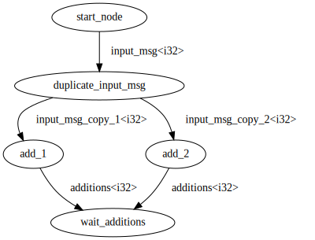

# DGE: Distributed Graph Execution

## What's this?

Conceptually:

- It provides building blocks (via `dge-gen`) to build a computational graph
  and generate the corresponding codes (that use `dge-runtime` as a dependency)
  to execute the graph
  
- The nodes in the graph represent heterogeneous computations

- The edges represent data flow between nodes

- The computational graph is static, meaning it cannot be changed once defined
  
- The execution is distributed, meaning the nodes can be executed on different machines

Concretely:

- You define the graph via `dge-gen` in a `.rs` file,
  compile & run it to generate the codes (including `main.rs`) that will be used to execute the graph

- You compile the `main.rs` to an executable binary,
  each subcommand in this binary corresponds to a node in the graph.

- You are responsible to launch the binary with appropriate subcommands.
  (i.e. DGE does not handle the deployment and launching of the binary)

- You can launch arbitrary amounts (`>= 1`) of instances of the same subcommand,
  potentially on different machines
  
- Each edge is backed by exactly one RabbitMQ queue, the nodes are consumers of this queue

## An example

The following graph corresponds to the computation `(2 * x) * (x * x)`:



and is generated with code in `dge-example/src/main_generate_code.rs`, here is a snippet of it:

```rust
use dge_gen;

fn main() {
    let mut graph = dge_gen::Graph::new(
        "dge_example::behaviour::accept_failure::accept_failure",
        "dge_example::behaviour::error::Error",
    );
    let start = graph.start("start");
    let fan_out = graph.fan_out(
        start,
        "input",
        "dge_example::behaviour::data::Integer",
        "duplicate_input",
        10
    );

    // ... some code omitted for brevity ...

    graph
        .generate(
            "dge-example/src/generated",
            "dge_example::behaviour::get_rmq_uri",
            "dge_example_work_exchange",
            "dge_example_retry_exchange",
            "retry_",
            "",
        )
        .unwrap()
}
```

A `main.rs` will be generated by the above code, and it has these subcommands:

```shell
dge-example

USAGE:
    example <SUBCOMMAND>

FLAGS:
    -h, --help       Prints help information
    -V, --version    Prints version information

SUBCOMMANDS:
    double                       
    duplicate-input              
    help                         Prints this message or the help of the given subcommand(s)
    init-exchanges-and-queues    
    multiply                     
    square     
```